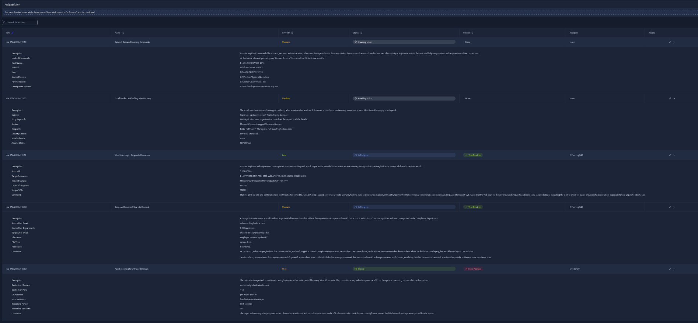
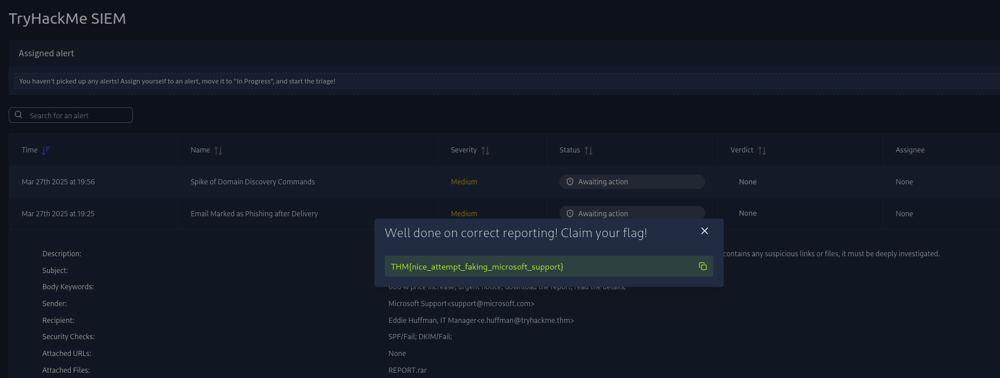
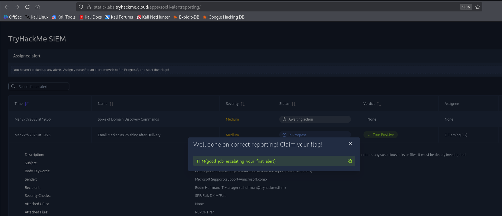
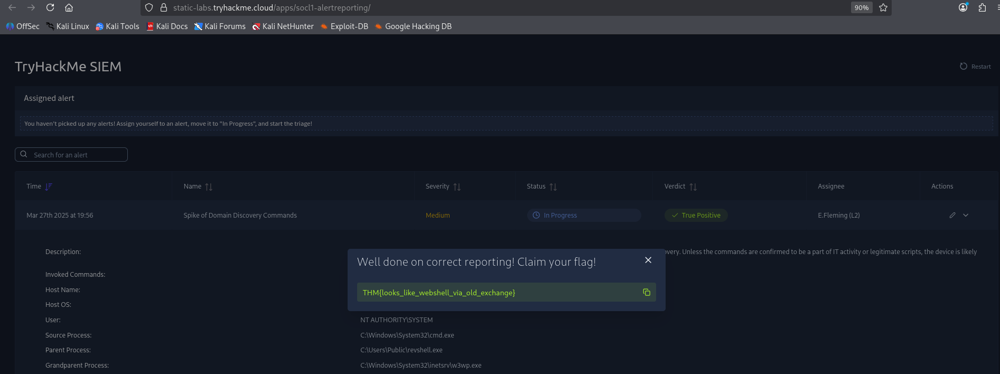

# SOC L1 Alert Reporting, Escalation & Communication

## Introduction

In a modern Security Operations Center (**SOC**), detecting suspicious activity is only the beginning. A SOC analyst must also properly document findings, escalate serious threats, and communicate effectively with senior analysts and other teams.

This room focuses on three critical SOC L1 analyst skills:

* Alert Reporting
* Alert Escalation
* SOC Communication

These are the exact workflows that help organizations detect, investigate, and respond to cyber threats efficiently. 🛡️

---

# Task 1 — Introduction

SOC analysts often face situations where:

* The alert cannot be confidently classified
* Additional context is required
* The activity appears malicious and urgent
* Senior analyst support becomes necessary

This room introduces how real SOC teams handle such situations professionally.

Some major learning objectives included:

* Writing proper alert reports
* Escalating incidents to L2 analysts
* Handling communication during investigations
* Understanding real-world SOC workflows

---

# Task 2 — Understanding the Alert Funnel

Every day, SOC teams process massive amounts of alerts generated from:

* SIEM solutions
* EDR platforms
* Network monitoring systems
* Security tooling

However, only a small percentage become real security incidents.

Typical SOC workflow:

| Stage | Responsibility                     |
| ----- | ---------------------------------- |
| L1    | Initial triage and filtering       |
| L2    | Deep investigation and remediation |
| DFIR  | Incident response and forensics    |

The overall goal is simple:

> Protect organizational assets before attackers can cause impact. 🔥

---

# Alert Reporting

Alert reporting is the process of formally documenting:

* What happened
* Who was involved
* Evidence collected
* Final analyst verdict

A strong report helps L2 analysts immediately understand the case without restarting the investigation from scratch.

---

# Alert Escalation

Escalation happens when:

* The activity appears malicious
* Further investigation is required
* Remediation actions are needed
* The analyst is uncertain about the verdict

Good escalation saves valuable response time during real incidents.

---

# Task 3 — Reporting Guide

A professional SOC report usually follows the **Five Ws** methodology.

| W     | Purpose                        |
| ----- | ------------------------------ |
| Who   | User or account involved       |
| What  | Suspicious activity detected   |
| When  | Timeline of events             |
| Where | Device, IP, or domain involved |
| Why   | Reasoning behind verdict       |

This reporting structure keeps investigations organized and easy to understand.

---

# Investigating the Sensitive Document Leak

The SOC dashboard showed that a sensitive document had been leaked by:

```text id="slv7ch"
m.boslan
```

We reviewed the alert details to identify the affected user and understand the suspicious activity tied to the document exposure.



---

# Investigating the Phishing Alert

The next alert involved a suspicious phishing email impersonating Microsoft support services.

The sender address was:

```text id="4j1uwc"
support@microsoft.com
```

At first glance, the sender attempts to appear trustworthy by abusing Microsoft's branding. This is a common phishing tactic used to increase user interaction rates.

We analyzed:

* Sender details
* Alert metadata
* Email behavior
* Potential phishing indicators

---

# Writing the Five Ws Alert Report

After analyzing the phishing alert, we documented the findings using the Five Ws methodology.

## PAYLOAD

```text id="xtj8u2"
WHO:
Targeted employee receiving the phishing email

WHAT:
Suspicious email impersonating Microsoft support

WHEN:
Activity timestamp observed in SIEM logs

WHERE:
Corporate email infrastructure

WHY:
The sender impersonation pattern and suspicious phishing indicators strongly suggest malicious intent
```

This reporting style helps L2 analysts quickly understand the investigation context and continue remediation efficiently. ✍️

---

# Capturing the Reporting Flag

Once the report was submitted successfully, the platform generated the following flag:

## PAYLOAD

```text id="v7wlto"
{nice_attempt_faking_microsoft_support}
```



---

# Task 4 — Escalation Guide

Not every alert can be fully handled by an L1 analyst.

Escalation becomes necessary when:

* Malware execution is suspected
* A webshell may exist
* Host isolation is required
* The analyst lacks sufficient context
* Incident response may be needed

A good SOC analyst knows when to escalate early instead of risking a missed compromise.

---

# Escalating the Alert to L2

The current assigned L2 analyst was:

## PAYLOAD

```text id="sjrm44"
E.Fleming
```

We moved the alert into investigation status, completed the initial analysis, documented our findings, and escalated the case for deeper investigation.

---

# Investigating the Exchange Webshell Alert

The second alert suggested suspicious activity involving an outdated Microsoft Exchange server.

Indicators pointed toward possible webshell deployment.

Webshells are dangerous because they allow attackers to:

* Execute remote commands
* Maintain persistence
* Upload additional malware
* Bypass normal authentication workflows

This type of activity often appears after exploiting vulnerable Exchange services. ⚠️

---

# Writing the Escalation Comment

We documented the suspicious findings before escalation.

## PAYLOAD

```text id="wvns53"
Observed suspicious Exchange-related activity indicating possible exploitation of outdated infrastructure.

The behavior suggests potential webshell deployment enabling persistence and remote command execution.

Recommend immediate L2 investigation and remediation actions.
```

This ensures the L2 analyst immediately understands:

* Why the activity is suspicious
* What indicators were observed
* Why escalation is necessary

```text id="4lfkz9"
{looks_like_webshell_via_old_exchange}
```



---

# Capturing the Final Flag

After completing the investigation and escalation workflow, the room generated the final flag.

## PAYLOAD

```text id="4lfkz9"
{looks_like_webshell_via_old_exchange}
```



---

# Task 5 — SOC Communication

Technical analysis alone is not enough in cybersecurity.

SOC analysts must also communicate effectively during:

* Active incidents
* Alert floods
* Escalation delays
* Infrastructure issues
* Missed detections

Some critical communication lessons included:

* Contact L2 first during emergencies
* Avoid contacting compromised users through breached platforms
* Inform senior analysts during alert overload situations
* Immediately report suspected misclassifications

Strong communication reduces confusion and improves incident response coordination. 📞

---

# Key Takeaways

This room introduced three fundamental SOC analyst skills:

| Skill            | Importance                                   |
| ---------------- | -------------------------------------------- |
| Alert Reporting  | Preserves evidence and investigation context |
| Alert Escalation | Ensures threats receive deeper analysis      |
| Communication    | Improves coordination during incidents       |

Together, these skills form the foundation of real-world SOC operations and incident handling workflows. 🚀

---

